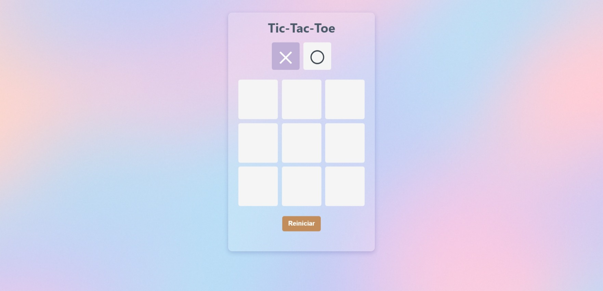

# ✨ Tic Tac Toe - Tres en Raya

Un pequeño proyecto hecho con **React** y **Vite**, donde puedes jugar al clásico juego de Tres en Raya (Tic Tac Toe). Ideal para practicar lógica, manejo de estados y estilos en React.

## 🖥️ Vista previa

## 🚀 Tecnologías Usadas

- **HTML** – Estructura básica del proyecto.
- **CSS** – Estilos personalizados para diseño y animaciones.
- **JavaScript (ES6+)** – Lógica principal del juego.
- **React** – Librería para construir la interfaz:
  - `useState` para manejar los estados del turno, las celdas y el ganador.
  - `useEffect` para controlar efectos como el guardado del juego en localStorage.
- **Vite** – Herramienta de desarrollo para crear el proyecto y levantar el servidor local.

## 🧠 Funcionalidades

- Dos jugadores en un mismo dispositivo.
- Turnos indicados en la parte superior.
- Detecta automáticamente el ganador o un empate.
- Animaciones suaves al marcar una casilla.
- Diseño responsivo.
- Reinicio de partida con un solo clic.

## 🛠️ Instalación

1. Clona el repositorio: `git clone https://github.com/erickdc7/tic-tac-toe.git`
2. Entra en el proyecto: `cd tic-tac-toe`
3. Instala las dependencias: `npm install`
4. Inicia el servidor de desarrollo: `npm run dev`
